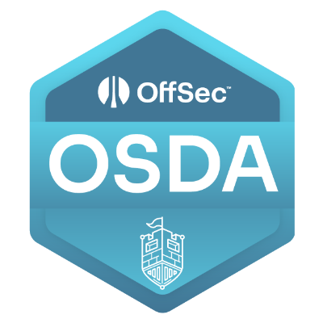
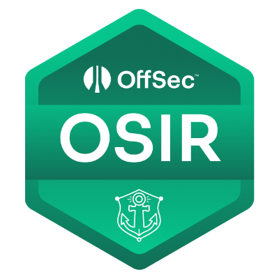
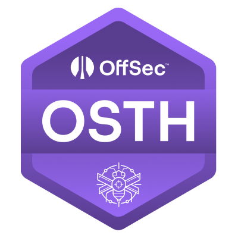
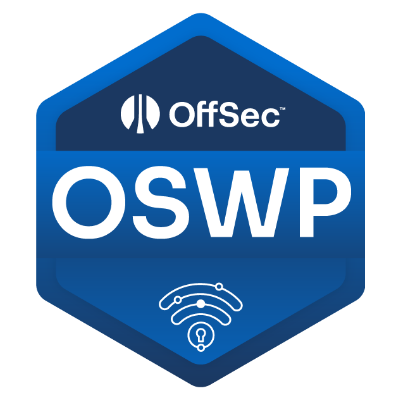
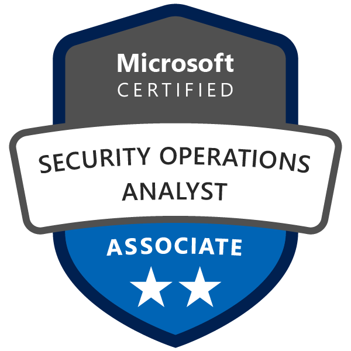
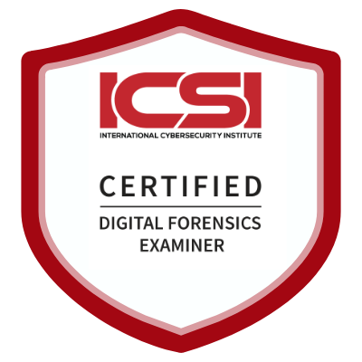

# Hi, I'm Panos (aka sys1ph0s) 🪨

**~$ whoami**

| Cybersecurity Professional | Incident Response & Digital Forensics |
| :--- | :--- |
| 4 Years of Experience | Blue Team Specialist & Purple Team Enthusiast |

Welcome to my digital boulder. I work in cybersecurity, and I write code to automate the endless grind of securing systems, gathering intel, and streamlining operations. 

---

## 💻 What I'm Building

Here are a few of the projects I've developed to bridge the gap between security and programming:

### Security & API Automation (Python)
* **[AutoInfoGather](https://github.com/sys1ph0s/AutoInfoGather):** A tool to automate OSINT tasks related to emails by combining industry favorite tools.
* **[Checkpoint_HEC_API](https://github.com/sys1ph0s/Checkpoint_HEC_API):** Automating Checkpoint HEC Block-List Management with Python.
* **[ZeroFox Takedown API](https://github.com/sys1ph0s/ZeroFox_Takedown_API):**  Automating ZeroFox takedown process with Python.

### Web Development (HTML/Django)
* **[Panos-Customs](https://github.com/sys1ph0s/Panos-Customs):**  Custom motorcycle demo website using django.

---

## 🛡️ Certifications & Verified Achievements

| Credential Badge | Certification & Verification |
| :---: | :--- |
|  | **OffSec Defense Analyst (OSDA)** [Verify ↗️](https://credentials.offsec.com/2b6b3899-6c49-4b39-996b-3bce9f0c5236#acc.yklvFJW0) |
|  | **OffSec Incident Responder (OSIR)** [Verify ↗️](https://credentials.offsec.com/2b6b3899-6c49-4b39-996b-3bce9f0c5236#acc.yklvFJW0) |
|  | **OffSec Threat Hunter (OSTH)** [Verify ↗️](https://credentials.offsec.com/5a735ead-fd77-469b-83cc-c95b27f4f28b#acc.Ryo3f5kv) |
|  | **OffSec Wireless Professional (OSWP)** [Verify ↗️](https://credentials.offsec.com/266506ac-a01a-4a13-8cd5-9d2b5405e60c#acc.ApqyZ51a) |
|  | **Microsoft Certified: Security Operations Analyst Associate (SC-200)** [Verify ↗️](https://learn.microsoft.com/api/credentials/share/en-us/PanagiotisPanagiotopoulos/9B9863B4D50E5?sharingId=FA879F45A162A761) |
|  | **ICSI - Certified Digital Forensics Examiner (CDFE)** [Verify ↗️](https://www.credential.net/bb490945-479f-4fbe-886e-cfac7f500b96#acc.5WZ3nbgM) |

## 📫 Let's Connect

Whether it's discussing DFIR, threat intel, Python scripts, or the myth of Sisyphus, feel free to reach out.

 
 

